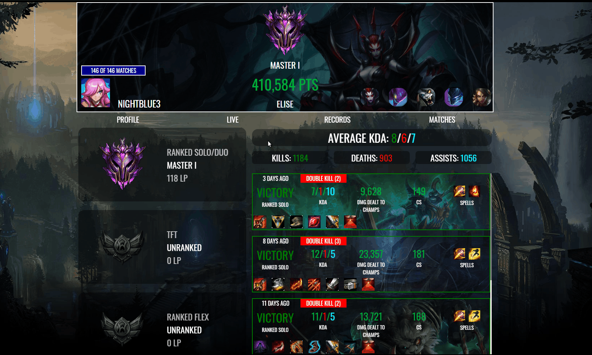

# Lol Static
> Lol Static is a Web Application built in ReactJs that gathers information about League of Legends matches, summoners and their match History.

> Official Url: https://lolstatic.netlify.com

### Home Page
- As you can see bellow you can search for a summoner in any League server and get their info. After it you have Ranks info, top matches and the average kda on the Profile section.

### Records
- On the records section you have the best highlights of the player's carrer, like, kills, deaths, assists etc...
 You can also see the match details of the Higlight as you can see below.

  ### Live Match 
 - On the live match it's possible to see the win percentage of every player in the game as well the mastery and points of the champion every summoner has picked.
 

 ### Match History 
 - On the match History section you have a filter where you can pick between game types like Normal games and Ranked and you can also filter them by champion name.
 
 
 

 
